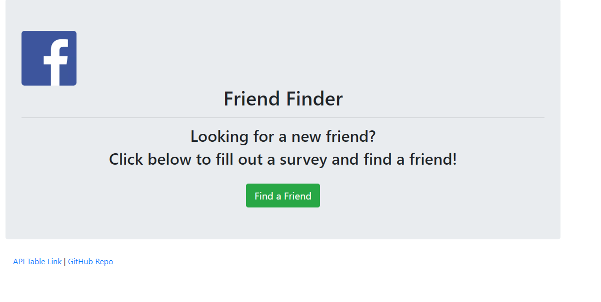
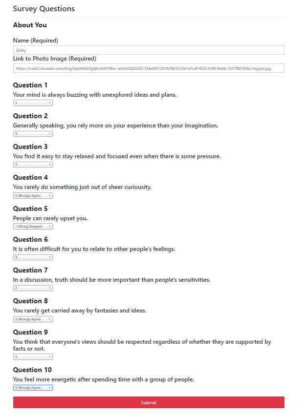
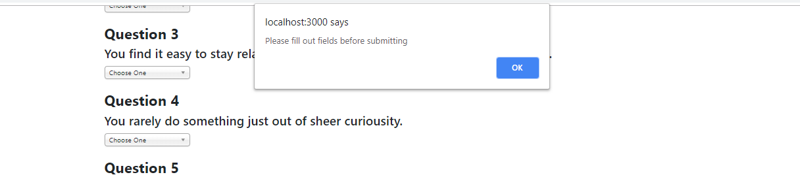
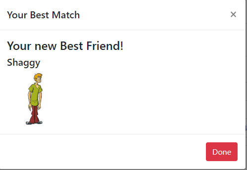
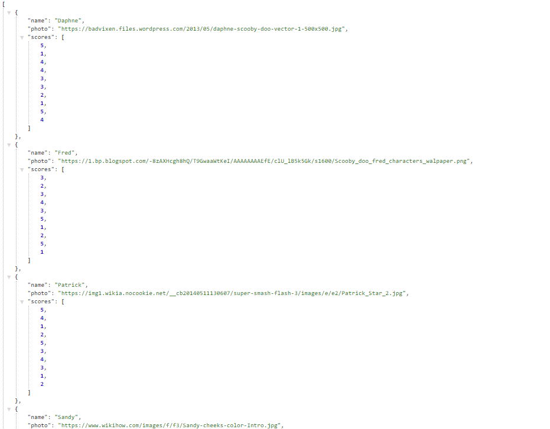
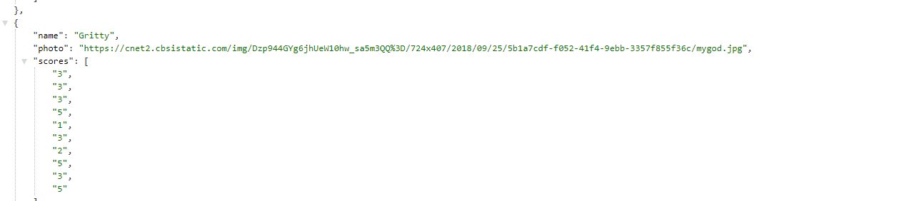

# Friend_Finder

## Technologies Used:

- JavaScript
- JQuery
- Express.js
- node.js

### The Friend Finder app is deployed via Heroku - link below:
https://friend-finder-1321.herokuapp.com/

### When going to the app you will be asked if you want to find a new friend - click into the app as asked below:

### After clicking into the app the below will appear - you will be required to fill out the answers and hit submit. Below is an example of a completed quiz:

### If answers are not given or anything is missed the below alert will appear:

### Upon asking answering a friend match will appear as shown below:

### This is matched per your answers based on the friends list stored as shown:

### Upon your completion of answering your question you will be logged to the friendslist:

